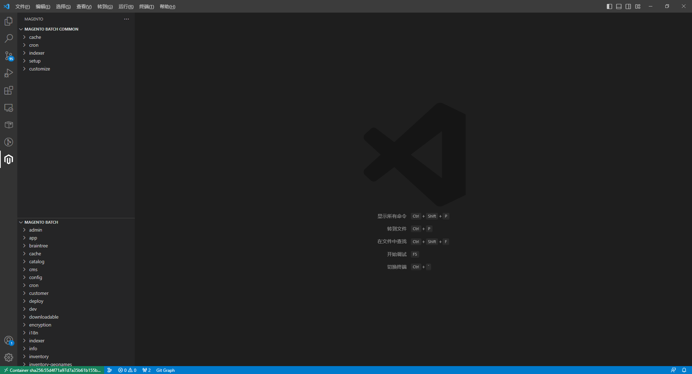
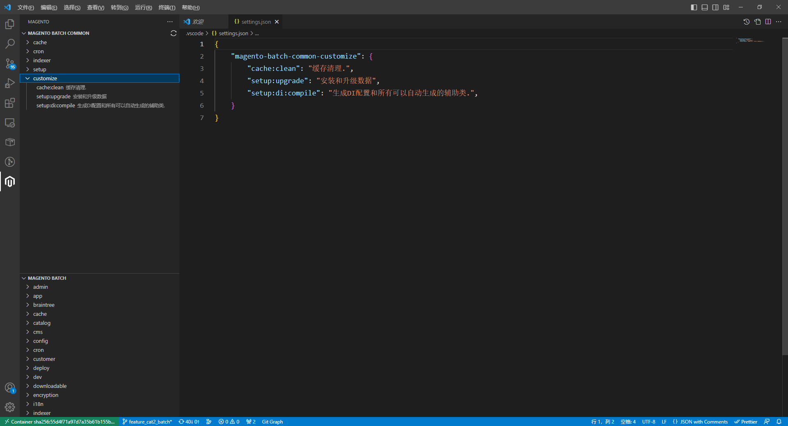
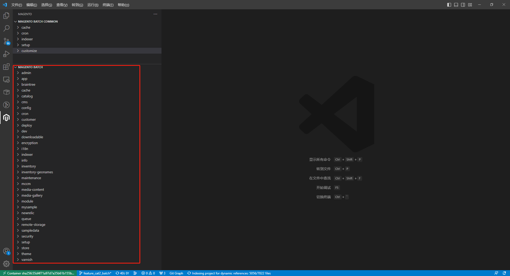
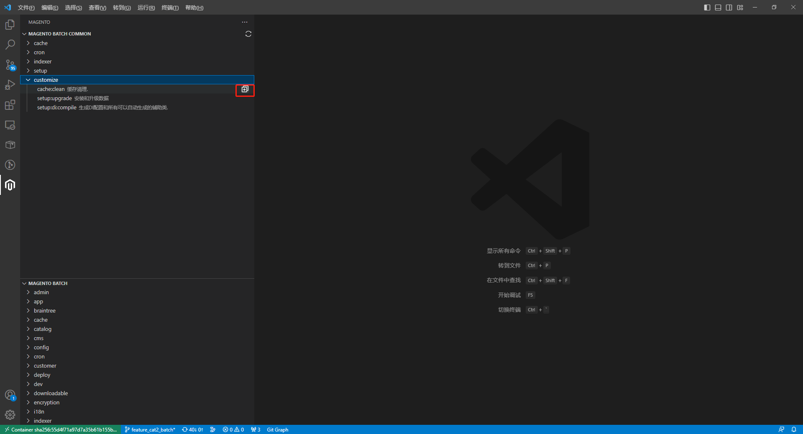
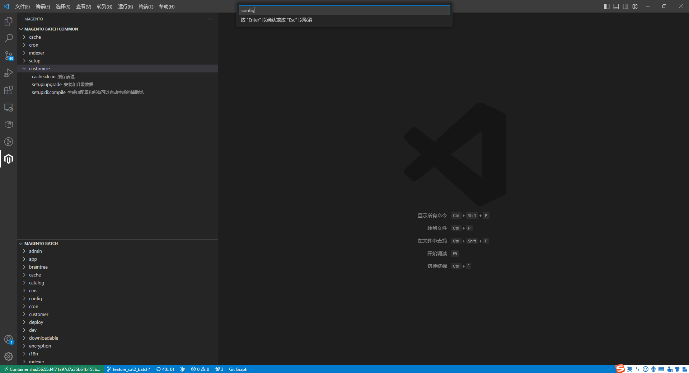
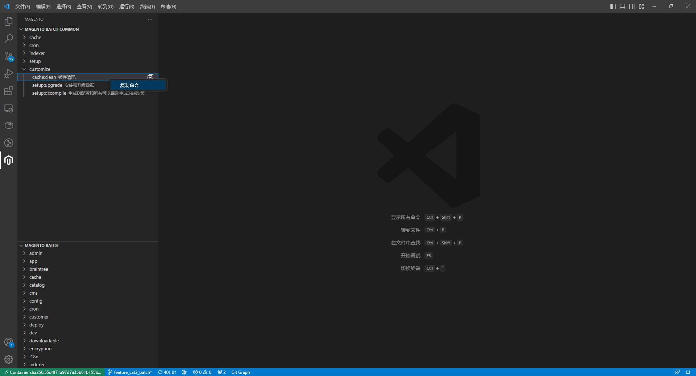

# Magento command 

- 智能读取 magento 的命令数据，方便使用

  

## 1. magento 常用命令部分：magento-batch-common

### 1.1：已存在的常用命令部分


### 1.2：自定义配置的常用命令

- 在  setting.json 文件中配置即可

```json
{
    "magento-batch-common-customize": {
        "cache:clean": "缓存清理.",
        "setup:upgrade": "安装和升级数据",
        "setup:di:compile": "生成DI配置和所有可以自动生成的辅助类.",
    }
}
```



## 2. magento 所有命令展示

- 展示 magento 当前可用的所用 command 命令信息



## 3. 调用命令时追加参数





## 4. 命令复制



